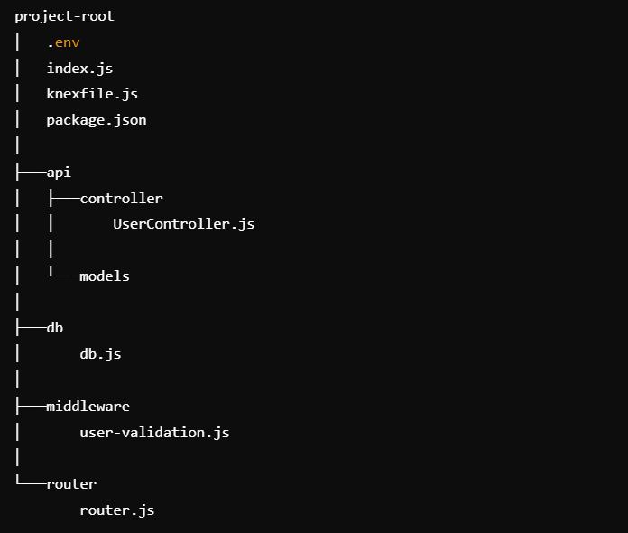

# Setup Project Node.js in Windows
Setting up a Node.js project on Windows involves a series of steps to initialize the project, install necessary dependencies, and establish a proper directory structure. This guide provides a comprehensive walkthrough to help you set up a robust Node.js application using Express.js, Knex.js, and other essential middleware and tools. Follow these instructions to quickly get your project up and running on a Windows environment.


## Steps to Setup the Project:
### 1. define your project folder
### 2. open your project folder
### 3. open powershell then clone the script in your project root folder
```bash
git clone https://github.com/bimass1/setup-project-nodejs-in-windows
```
### 4. Just run the `setup.bat` script on your Windows computer

```bash
call setup.bat
```

### Project Architecture


This project follows the MVC (Model-View-Controller) architectural pattern, which is a common pattern for structuring applications. The following is a detailed explanation of each component in this architecture:

1. `(api/models)`
Models are responsible for handling data and business logic. They define the data structure, interaction with the database, and any validation or transformation required before the data is processed or stored.

2. `(api/controller)`
The controller acts as an intermediary between the model and the view. They process incoming requests, interact with the model to retrieve or update data, and return responses to the client. For example, UserController.js will handle requests related to user data.

3. `(middleware)`
Middleware functions are executed during the request-response cycle and can perform tasks such as validation, authentication, logging, etc. The user-validation.js file, for example, might contain logic to validate user input before it reaches the controller.

4. `(router/router.js)`
Routers determine routes and map them to appropriate controller functions. They handle incoming HTTP requests and route them to the appropriate controller based on the URL and HTTP method.

5. `(db/db.js)`
This file contains the configuration for connecting to the database using Knex.js. It manages database connection settings and can also include initialization logic.

6. `(index.js)`
The index.js file is the main entry point of the application. It sets up the Express server, middleware, routing, and starts the server on a specific port.

7. `Environment Variables (.env)`
.env files are used to store environment-specific settings, such as database connection strings, API keys, and port numbers, that can be accessed across applications.

### dependencies installed by default
- express
- cors
- pg
- morgan
- jsonwebtoken
- cors
- bcrypt
- express-validator
- dotenv
- nodemon
